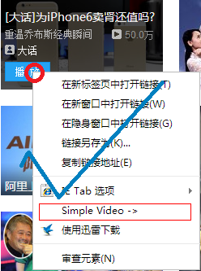
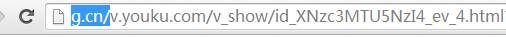
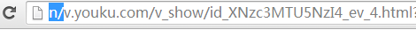

># SimpleVideo

>#### SimpleVideo[alpha] demo: [宿主站点 - imzker.com](http://www.imzker.com)

>####使用方法, 以优酷为例:
<pre>
视频播放页: http://v.youku.com/v_show/id_XODMwNTUwMjIw.html
SimpleVideo: http://imzker.com/v.youku.com/v_show/id_XODMwNTUwMjIw.html
</pre>
>> 如果您使用的是*Chrome*浏览器，可安装*sv*插件，便捷的使用*SimpleVideo*.
>> ######插件安装地址: 
1. [宿主站点] [http://imzker.com/ab/ChromeExt](http://imzker.com/ab/ChromeExt)
2. [./ChromeExt/sv.crx](./ChromeExt/sv.crx)
3. [Chrome 网上应用商店店] 暂未提交

--------------------------------------------------------

>## 关于API中的token:
>>
1. SimpleVideo API: [https://github.com/DD-L/SimpleVideo-API.git](https://github.com/DD-L/SimpleVideo-API.git)

>>
2. 代码中的$TOKEN为敏感信息, 请到API提供者那里申请

>>>* /source/d-l.top.class.php 中的$TOKEN 请到 [D-L.top](http://d-l.top) 申请
>>>* /source/Flvxz.class.php 中的$TOKEN 请到 [flvxz.com](http://www.flvxz.com) 申请（友情提示：flvxz.com已阵亡）
>>>* /source/Id97.class.php 当前已不对外开放API

> 欲了解更多信息, 请访问[D-L.top](http://d-l.top)

-------------------------------------------------------

> ###SimpleVideo 特性：
>> 
1. 面向接口, 易于对音视频解析API站点的扩展.
2. 为便于使用SimpleVideo, 提供hrome *sv*插件; 插件无需干预可自动更新.
3. 数据缓存: 自动缓存; 缓存手动刷新; 缓存清理.
4. 支持在线观看.
5. 无源站点广告，链接对外暴露，可自由下载.
6. 支持url rewrite, 访问更加直观
7. *容我想一会儿* ^_^

---------------------------------------------------------

> ###Chrome sv插件options页:
>>
<pre>

<h3>Simple Video</h3>

示例视频地址： http://v.youku.com/v_show/id_XNzc0NzgzMTc2.html  
使用方法： 
http://<b>imzker.com/</b>v.youku.com/v_show/id_XNzc0NzgzMTc2.html [使用条件: 无]   
http://<b>g.cn/</b>v.youku.com/v_show/id_XNzc0NzgzMTc2.html [使用条件: 须装此扩展] 
http://<b>n/</b>v.youku.com/v_show/id_XNzc0NzgzMTc2.html [使用条件: 须装此扩展，且在路由器环境下使用，并修改hosts文件] 

 
嫌 imzker.com/ 太长? 安装此扩展即可使用 <b>g.cn/</b> 甚至 <b>n/</b> 来代替 <b>imzker.com/</b> 
 
如果想使用 n/ 必须 在 hosts文件中添加：  
# 192.168.1.1 为路由器地址 
192.168.1.1 n  

<h5>version 0.0.3</h5>

	
1. 增加对链接的右键菜单支持, 无需在地址栏手动输入.
		

			
			
		

	

<h5>version 0.0.2</h5>

	
1. 在地址栏中头部添加 g.cn/ 或 n/ 即可使用 Simple Video.
		

			方法一: [使用条件: 无需安装此扩展] 
			方法二: [使用条件: 须装此扩展] 
			方法三: [使用条件: 须装此扩展，且在路由器环境下使用，并修改hosts文件] 
		

	

</pre>

---------------------------------------------------------

> #####[LICENSE](./LICENSE)
&copy; Deel@d-l.top | [d-l.top](http://d-l.top)
